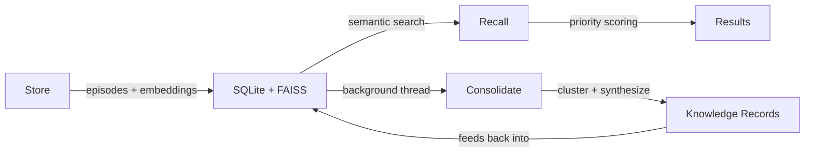
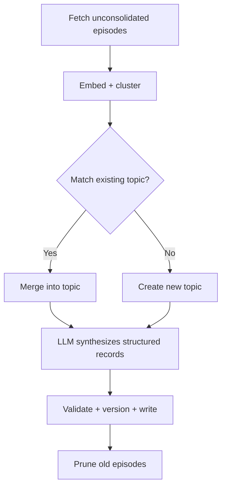

<div align="center">

# consolidation-memory

**Memory that gets smarter while your agent sleeps.**

Most AI memory systems are glorified vector stores — they embed, they retrieve, they forget. consolidation-memory does something different: it runs a background process that clusters your raw episodes, synthesizes them through an LLM, and distills structured knowledge records — automatically, without agent intervention. Your memories don't just accumulate. They consolidate.

This is the same trick your brain uses. Neuroscience calls it memory consolidation: during sleep, the hippocampus replays recent experiences and transfers distilled patterns to the neocortex for long-term storage. Raw episodes become durable knowledge. consolidation-memory applies this process to AI agents — a background thread replays stored episodes, clusters them by semantic similarity, and uses an LLM to synthesize structured knowledge records (facts, solutions, preferences) that feed back into future recall.

The result: an agent that remembers not just *what* happened, but *what it learned*.

[](https://pypi.org/project/consolidation-memory/)
[](https://github.com/charliee1w/consolidation-memory/actions)
[](https://pypi.org/project/consolidation-memory/)
[](LICENSE)

</div>

```
You: "My build is failing with a linker error"
AI:  (recalls your project uses CMake + MSVC on Windows)
     (recalls you hit the same error last month — it was a missing vcpkg dependency)
     "Last time this happened it was a missing vcpkg package. Want me to
      check if your vcpkg.json changed since we fixed it?"
```

This isn't retrieval. The agent never explicitly stored "this user's linker errors come from vcpkg." That knowledge was *synthesized* during consolidation from scattered episodes across multiple sessions.

## Why Consolidation Matters

Vector search finds what you stored. Consolidation finds what you *learned*.

| | Vector store | consolidation-memory |
|---|---|---|
| **Store** | Embed text, save vector | Same |
| **Recall** | Nearest-neighbor search | Semantic search + knowledge records |
| **Over time** | Index grows, recall degrades | Background LLM distills knowledge, prunes noise |
| **Knowledge** | Whatever you explicitly saved | Emergent — synthesized from episode clusters |
| **Maintenance** | Manual curation or nothing | Automatic background consolidation |

Without consolidation, your memory system is a write-once archive. With it, memory compounds.

## Why Not X?

There are good AI memory tools out there. Here's why consolidation-memory exists anyway.

| | consolidation-memory | Mem0 | Zep | Letta (MemGPT) | Cognee |
|---|---|---|---|---|---|
| **Core mechanism** | Background LLM consolidation — clusters episodes, synthesizes knowledge records automatically | Write-time extraction — LLM extracts facts on every `add()` call | Session summaries — compresses conversation windows into summaries | Agent self-management — the LLM decides what to store in its own context | ETL pipeline — extracts, chunks, builds knowledge graph |
| **When synthesis happens** | Background thread (async, off the hot path) | Synchronously at write time | End of session / window | During agent turns (uses agent compute) | Explicit pipeline run |
| **Knowledge structure** | Typed records (fact, solution, preference) from episode clusters | Flat extracted facts | Session summary nodes + temporal graph | Agent-managed text blocks | Knowledge graph (nodes + edges) |
| **Infrastructure** | SQLite + FAISS (two files) | Qdrant/Postgres + graph DB (self-hosted) or cloud API | Postgres + Neo4j (cloud) or Graphiti (Apache 2.0) | Postgres + agent runtime | Neo4j or Kuzu + vector DB |
| **Local-first** | Yes — runs on a laptop with no network | Partial — OSS needs Qdrant | No — cloud-first, OSS community edition deprecated | Yes — but requires running agent server | Partial — needs graph DB |
| **MCP native** | Yes | Yes (added later) | No | No | Yes (added later) |
| **Zero config** | `pip install` + `init` | Docker compose or API key | API key + cloud setup | `pip install` + server setup | `pip install` + graph DB |

**Mem0** extracts facts at write time — every `add()` call invokes the LLM to parse and store structured facts. This works, but it means your extraction quality is bounded by what the LLM can infer from a single episode in isolation. consolidation-memory's background consolidation sees *clusters* of related episodes together, letting it synthesize cross-session patterns that no single episode contains.

**Zep** summarizes conversation sessions and builds a temporal knowledge graph. It's designed for chat applications with clear session boundaries. consolidation-memory operates on individual episodes from any source — it doesn't assume a chat-session structure, and its consolidation clusters by semantic similarity rather than temporal adjacency.

**Letta (MemGPT)** makes the agent itself responsible for memory management — the LLM decides what to write to its core memory and archival storage during its own turns. This is elegant but uses agent compute for memory housekeeping and requires the agent to be well-prompted for self-management. consolidation-memory moves this work to a background thread that runs independently of agent sessions.

**Cognee** builds knowledge graphs through an ETL-style pipeline — powerful for structured reasoning over entities and relationships, but it needs graph database infrastructure (Neo4j or Kuzu). consolidation-memory's approach is deliberately simpler: SQLite + FAISS, two files, runs on a laptop.

## How It Works



1. **Store** — Save episodes (facts, solutions, preferences) with embeddings into SQLite + FAISS
2. **Recall** — Semantic search with priority scoring (surprise, recency, access frequency)
3. **Consolidate** — Background LLM clusters related episodes and synthesizes structured knowledge records

### Consolidation Detail



Runs on a background thread (default: every 6 hours). Episodes are grouped by hierarchical clustering, matched to existing knowledge topics by semantic similarity, then synthesized into structured records (facts, solutions, preferences) via LLM. Three consecutive failures trigger a circuit breaker to avoid burning through timeouts.

## Quick Start

```bash
pip install consolidation-memory[fastembed]
consolidation-memory init
```

FastEmbed runs locally — no external services needed.

## Integrations

<details open>
<summary><strong>MCP Server</strong></summary>

Add to your MCP client config (`claude_desktop_config.json`, `.claude/settings.json`, etc.):

```json
{
  "mcpServers": {
    "consolidation_memory": {
      "command": "consolidation-memory"
    }
  }
}
```

| Tool | Description |
|------|-------------|
| `memory_store` | Save an episode (fact, solution, preference, exchange) |
| `memory_store_batch` | Store multiple episodes in one call (single embed + FAISS batch) |
| `memory_recall` | Semantic search over episodes + knowledge, with optional filters |
| `memory_search` | Keyword/metadata search — works without embedding backend |
| `memory_status` | System stats, health diagnostics, and consolidation metrics |
| `memory_forget` | Soft-delete an episode by ID |
| `memory_export` | Export all episodes and knowledge to a JSON snapshot |
| `memory_correct` | Fix outdated knowledge documents with new information |
| `memory_compact` | Rebuild FAISS index, removing tombstoned vectors |
| `memory_consolidate` | Manually trigger a consolidation run |

</details>

<details>
<summary><strong>Python API</strong></summary>

```python
from consolidation_memory import MemoryClient

with MemoryClient() as mem:
    mem.store("User prefers dark mode", content_type="preference", tags=["ui"])

    result = mem.recall("user interface preferences")
    for ep in result.episodes:
        print(ep["content"], ep["similarity"])

    stats = mem.status()
    print(stats.health)  # {"status": "healthy", "issues": [], "backend_reachable": true}
```

</details>

<details>
<summary><strong>OpenAI Function Calling</strong></summary>

Works with any OpenAI-compatible API (LM Studio, Ollama, OpenAI, Azure):

```python
from consolidation_memory import MemoryClient
from consolidation_memory.schemas import openai_tools, dispatch_tool_call

mem = MemoryClient()
# Pass openai_tools to your chat completion, dispatch results with dispatch_tool_call()
```

</details>

<details>
<summary><strong>REST API</strong></summary>

```bash
pip install consolidation-memory[rest]
consolidation-memory serve --rest --port 8080
```

| Method | Path | Description |
|--------|------|-------------|
| `GET` | `/health` | Version + status |
| `POST` | `/memory/store` | Store episode |
| `POST` | `/memory/store/batch` | Store multiple episodes |
| `POST` | `/memory/recall` | Semantic search (with optional filters) |
| `POST` | `/memory/search` | Keyword/metadata search (no embedding needed) |
| `GET` | `/memory/status` | System statistics + consolidation metrics |
| `DELETE` | `/memory/episodes/{id}` | Forget episode |
| `POST` | `/memory/consolidate` | Trigger consolidation |
| `POST` | `/memory/correct` | Correct knowledge doc |
| `POST` | `/memory/export` | Export to JSON |

</details>

## Backends

### Embedding

| Backend | Install | Model | Local |
|---------|---------|-------|:-----:|
| **FastEmbed** (default) | `pip install consolidation-memory[fastembed]` | bge-small-en-v1.5 | Y |
| LM Studio | Built-in | nomic-embed-text-v1.5 | Y |
| Ollama | Built-in | nomic-embed-text | Y |
| OpenAI | `pip install consolidation-memory[openai]` | text-embedding-3-small | N |

### LLM

| Backend | Requirements |
|---------|-------------|
| **LM Studio** (default) | LM Studio running with any chat model |
| Ollama | Ollama running with any chat model |
| OpenAI | API key |
| Disabled | None — no consolidation, pure vector search |

## Configuration

```bash
consolidation-memory init
```

<details>
<summary>Manual configuration</summary>

| Platform | Path |
|----------|------|
| Linux/macOS | `~/.config/consolidation_memory/config.toml` |
| Windows | `%APPDATA%\consolidation_memory\config.toml` |
| Override | `CONSOLIDATION_MEMORY_CONFIG` env var |

```toml
[embedding]
backend = "fastembed"

[llm]
backend = "lmstudio"
api_base = "http://localhost:1234/v1"
model = "qwen2.5-7b-instruct"

[consolidation]
auto_run = true
interval_hours = 6
cluster_threshold = 0.72
prune_enabled = true
prune_after_days = 60
```

</details>

## CLI

| Command | Description |
|---------|-------------|
| `consolidation-memory serve` | Start MCP server (default) |
| `consolidation-memory serve --rest` | Start REST API |
| `consolidation-memory --project work serve` | Start MCP server for a specific project |
| `consolidation-memory init` | Interactive setup |
| `consolidation-memory status` | Show stats |
| `consolidation-memory consolidate` | Manual consolidation |
| `consolidation-memory export` | Export to JSON |
| `consolidation-memory import PATH` | Import from JSON |
| `consolidation-memory reindex` | Re-embed everything (after switching backends) |

## Multi-Project Support

Isolate memories per project — work memories stay in work, personal stays in personal.

```bash
# CLI flag
consolidation-memory --project work status
consolidation-memory --project personal serve --rest --port 8081

# Environment variable
CONSOLIDATION_MEMORY_PROJECT=work consolidation-memory serve
```

### MCP (Claude Desktop) — Multiple Projects

Add separate server entries per project:

```json
{
  "mcpServers": {
    "memory-work": {
      "command": "consolidation-memory",
      "env": { "CONSOLIDATION_MEMORY_PROJECT": "work" }
    },
    "memory-personal": {
      "command": "consolidation-memory",
      "env": { "CONSOLIDATION_MEMORY_PROJECT": "personal" }
    }
  }
}
```

Each project gets its own database, vector index, and knowledge files. Config and embedding/LLM backends are shared. When no project is specified, `default` is used. Existing users are auto-migrated to `projects/default/` on first run.

## Data Storage

All data stays local.

| Platform | Path |
|----------|------|
| Linux | `~/.local/share/consolidation_memory/projects/<name>/` |
| macOS | `~/Library/Application Support/consolidation_memory/projects/<name>/` |
| Windows | `%LOCALAPPDATA%\consolidation_memory\projects\<name>\` |

<details>
<summary>Migrating</summary>

Point your config at an existing data directory:

```toml
[paths]
data_dir = "/path/to/your/existing/data"
```

Switching embedding backends (different dimensions)?

```bash
consolidation-memory reindex
```

</details>

## Development

```bash
git clone https://github.com/charliee1w/consolidation-memory
cd consolidation-memory
pip install -e ".[all,dev]"
pytest tests/ -v
ruff check src/ tests/
```

## License

MIT
