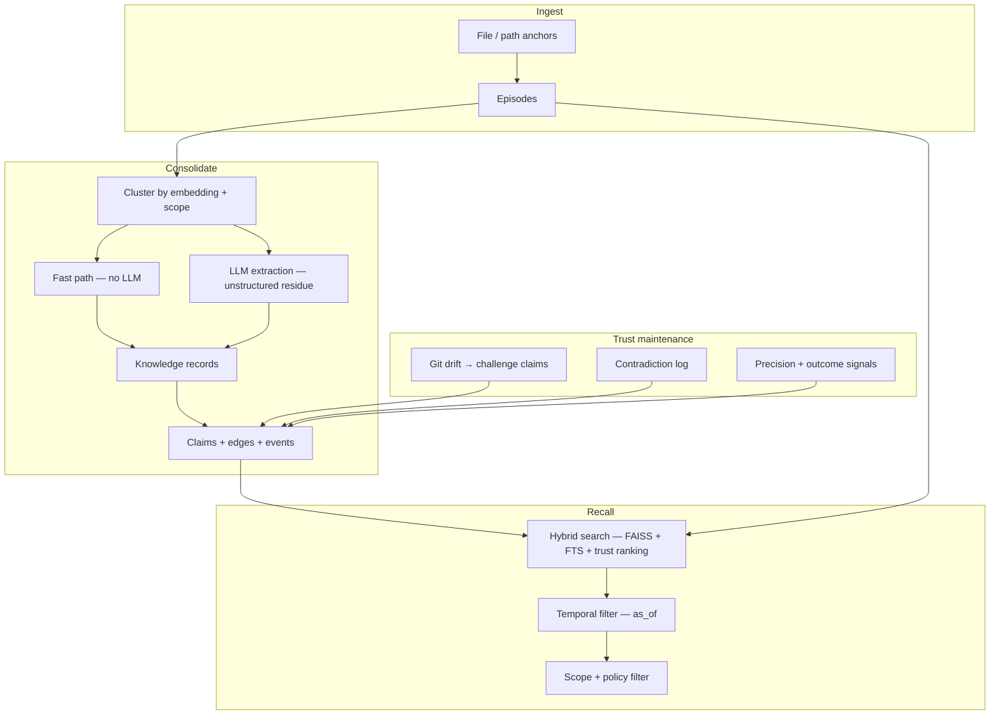

# consolidation-memory

[](https://pypi.org/project/consolidation-memory/)
[](https://github.com/charliee1w/consolidation-memory/releases)
[](https://github.com/charliee1w/consolidation-memory/actions)
[](https://pypi.org/project/consolidation-memory/)
[](LICENSE)

**Trust-calibrated working memory for coding agents.**

Store what happened. Consolidate what you learned. Recall with provenance — and lower trust when the repo moves on.

`consolidation-memory` is local-first agent memory built for long-horizon coding work: SQLite + FAISS + markdown topics on disk, one semantic contract across Python, MCP, REST, and OpenAI-style tools, and explicit trust signals instead of opaque similarity search.

---

## At a glance

| | Typical agent memory | consolidation-memory |
| --- | --- | --- |
| Unit of reuse | Embedded chat snippets | **Claims** — hash-stable beliefs with provenance |
| Raw input | Same blob as retrieval | **Episodes** — evidence kept separate from beliefs |
| Staleness | Hidden until wrong | **Drift challenge** when anchored files change |
| Time | Present-tense only | **`as_of`** queries for prior belief states |
| Sharing | Hope the filter works | **Scope envelopes** + persisted policy/ACL primitives |
| Consolidation | Always calls an LLM | **Fast path** for structured episodes; LLM only for residue |

**Focus:** drift-aware debugging memory — preserve fixes, recall with trust signals, degrade gracefully after refactors.

---

## Mental model

> claims are the reusable unit; episodes are the raw evidence behind them.

```text
  Episode                 Evidence from a session (chat, tool output, structured JSON)
      │
      ▼ consolidation
  Knowledge record        Typed fact · solution · preference · procedure · strategy
      │
      ▼ deterministic materialization
  Claim                   Reusable belief + sources + lifecycle events
      │
      ▼ human-readable view
  Topic                   Markdown file + DB rows you can open and audit
```

Contradictions, challenges, and expiry stay visible. The system does not silently overwrite uncertain beliefs.



Deep dive: [Architecture](docs/ARCHITECTURE.md)

---

## Capabilities

### Hybrid recall

Semantic vectors (FAISS), keyword fallback (FTS5 when available), and metadata-aware ranking across episodes, topics, records, and claims. Responses can include uncertainty, contradiction context, strategy evidence, and scope attribution.

### Consolidation with a deterministic fast path

Related episodes cluster by embedding similarity with scope isolation. Structured episodes consolidate **without LLM calls** when they match [fast-path shapes](docs/FAST_PATH_EPISODES.md); everything else falls back to your configured LLM backend (or fails clearly when `llm.backend = "disabled"`).

### Drift-aware trust

`detect_drift` maps `git` changes → file anchors → impacted claims → auditable `code_drift_detected` events. Stale debugging conclusions lose precision instead of masquerading as fresh facts.

### Temporal correctness

Query what was believed at a point in time with `as_of` on recall and claim search — useful after refactors, rollbacks, or postmortems.

### Scoped sharing

Namespace, project, app, agent, and session columns persist on memory rows. Policy and ACL tables support intentional sharing without accidental cross-project leakage. Details: [Architecture — scope](docs/ARCHITECTURE.md).

### Adaptive scheduling

A utility scheduler weighs backlog pressure, recall misses, contradiction spikes, challenged claims, and failed action outcomes. `memory_status` exposes `utility_scheduler.run_decision.explanation`, `fast_path_hits`, `llm_fallbacks`, and `trust_profile` so automation is inspectable, not magical.

### Surface parity

Every transport routes through `MemoryClient` and shared query semantics — no “MCP-only” behavior drift.

| Surface | Entry |
| --- | --- |
| Python | `from consolidation_memory import MemoryClient` |
| MCP | `consolidation-memory serve` / `python -m consolidation_memory serve` |
| REST | `consolidation-memory serve-rest` (optional `[rest]` extra) |
| OpenAI tools | `schemas.openai_tools` + `dispatch_tool_call` |

---

## Quick start

```bash
pip install "consolidation-memory[fastembed]"
consolidation-memory init
consolidation-memory test
consolidation-memory serve
```

During `init`, choose **`disabled`** for the LLM backend unless you already run LM Studio, Ollama, or OpenAI. You still get durable storage, hybrid recall, drift detection, and MCP serving.

**Optional extras**

| Extra | Enables |
| --- | --- |
| `[fastembed]` | Local embeddings (recommended default) |
| `[openai]` | Hosted OpenAI embeddings / LLM |
| `[rest]` | FastAPI HTTP server |
| `[dashboard]` | Textual TUI inspector |
| `[desktop]` | Native desktop UI with system tray icon (`consolidation-memory app`) |
| `[all,dev]` | Full stack + test/lint tooling |

Backend matrix: [Model support](docs/MODEL_SUPPORT.md) · Runnable wiring: [examples/](examples/README.md)

---

## Connect your agent (MCP)

Use an **absolute Python path** — more reliable than a console script, especially on Windows:

```json
{
  "mcpServers": {
    "consolidation_memory": {
      "command": "/absolute/path/to/python",
      "args": ["-m", "consolidation_memory", "--project", "default", "serve"],
      "env": {
        "PYTHONUNBUFFERED": "1",
        "CONSOLIDATION_MEMORY_IDLE_TIMEOUT_SECONDS": "900"
      }
    }
  }
}
```

Drop-in configs: [Cursor](examples/cursor-integration/README.md) · [Continue](examples/continue-dev/README.md)

**Simple profile** (3 tools for newcomers): add `"CONSOLIDATION_MEMORY_MCP_TOOL_PROFILE": "simple"` to
`env` — exposes `memory_recall`, `memory_remember`, and `memory_ask` only. `consolidation-memory init`
prints both full and simple JSON snippets.

### MCP tools (representative)

| Tool | Purpose |
| --- | --- |
| `memory_store` / `memory_store_batch` | Persist episodes with type, tags, scope |
| `memory_recall` | Hybrid recall over episodes, topics, records, claims |
| `memory_search` | Plain-text search (non-semantic) |
| `memory_claim_search` / `memory_claim_browse` | Claim-centric retrieval |
| `memory_detect_drift` | Git-based claim challenge |
| `memory_consolidate` | Run consolidation on demand |
| `memory_status` | Health, scheduler, trust_profile, fast-path metrics |
| `memory_timeline` / `memory_contradictions` | Audit lifecycle and conflicts |
| `memory_export` / `memory_correct` | Backup and human corrections |
| `memory_outcome_record` / `memory_outcome_browse` | Link actions to outcomes |

Full schemas: [`src/consolidation_memory/schemas.py`](src/consolidation_memory/schemas.py)

---

## Python API

```python
from consolidation_memory import MemoryClient

with MemoryClient(auto_consolidate=False) as mem:
    mem.store(
        "Prefer PR summaries with concrete file paths, not high-level narration.",
        content_type="preference",
        tags=["workflow", "reviews"],
    )
    result = mem.recall("how should I format PR summaries?", n_results=5)
    print(result.episodes, result.claims)
```

Challenge stale beliefs after code changes:

```python
report = mem.detect_drift()
print(report.challenged_claim_ids)
```

Inspect trust and scheduler state:

```python
status = mem.status()
print(status["trust_profile"])
print(status["utility_scheduler"]["run_decision"]["explanation"])
```

---

## LLM-optional consolidation

Set `llm.backend = "disabled"` and store episodes in [fast-path shapes](docs/FAST_PATH_EPISODES.md) — preferences, path-anchored solutions, JSON facts/procedures/strategies. Consolidation stays deterministic; unstructured residue simply does not consolidate until you enable an LLM.

`memory_status` reports extraction mix (`fast_path_hits`, `llm_fallbacks`), consolidation quality aggregates, and why the scheduler would run next.

---

## Who this is for

**Good fit**

- Developers using Cursor, Claude Code, Continue, or custom agents on real repositories
- Teams that need durable agent memory with explicit scope boundaries
- Workflows where file changes should reduce trust in prior conclusions
- Builders who want inspectable on-disk artifacts, not a hosted black box

**Not a fit**

- Generic “remember everything” consumer assistants
- Replacing git, issue trackers, or canonical product docs
- Opaque vector RAG with no provenance story

---

## Privacy and data

- No built-in telemetry.
- Default data dir: `platformdirs.user_data_dir("consolidation_memory")/projects/<project>/`
- Network I/O only to embedding/LLM backends **you** configure.
- REST binds require auth before non-loopback exposure.

---

## Documentation

| Doc | Why read it |
| --- | --- |
| [Architecture](docs/ARCHITECTURE.md) | Modules, persistence, data flow |
| [Fast-path episodes](docs/FAST_PATH_EPISODES.md) | LLM-free consolidation shapes |
| [Model support](docs/MODEL_SUPPORT.md) | Embedding and LLM backends |
| [Examples](examples/README.md) | Cursor, REST, LangGraph, plugins |

Contributors: see [CONTRIBUTING.md](CONTRIBUTING.md).

---

## Community

- [Issues](https://github.com/charliee1w/consolidation-memory/issues)
- [Discussions](https://github.com/charliee1w/consolidation-memory/discussions)
- [Releases](https://github.com/charliee1w/consolidation-memory/releases) · [Changelog](CHANGELOG.md)
- [Security policy](https://github.com/charliee1w/consolidation-memory/security/policy)

MIT · [Code of Conduct](CODE_OF_CONDUCT.md)