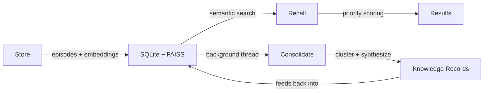
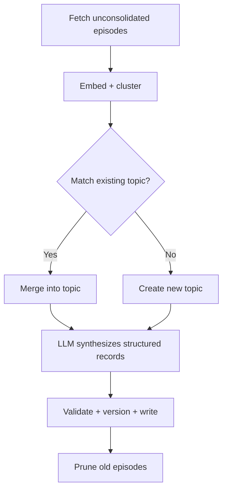

<div align="center">

# consolidation-memory

**Your AI forgets everything between sessions. This fixes that.**

A local-first memory system that stores, retrieves, and *consolidates* knowledge across conversations — automatically.

[](https://pypi.org/project/consolidation-memory/)
[](https://github.com/charliee1w/consolidation-memory/actions)
[](https://pypi.org/project/consolidation-memory/)
[](LICENSE)

</div>

```
You: "My build is failing with a linker error"
AI:  (recalls your project uses CMake + MSVC on Windows)
     (recalls you hit the same error last month — it was a missing vcpkg dependency)
     "Last time this happened it was a missing vcpkg package. Want me to
      check if your vcpkg.json changed since we fixed it?"
```

## How It Works



1. **Store** — Save episodes (facts, solutions, preferences) with embeddings into SQLite + FAISS
2. **Recall** — Semantic search with priority scoring (surprise, recency, access frequency)
3. **Consolidate** — Background LLM clusters related episodes and synthesizes structured knowledge records

## Quick Start

```bash
pip install consolidation-memory[fastembed]
consolidation-memory init
```

FastEmbed runs locally — no external services needed.

## Integrations

<details open>
<summary><strong>MCP Server</strong></summary>

Add to your MCP client config (`claude_desktop_config.json`, `.claude/settings.json`, etc.):

```json
{
  "mcpServers": {
    "consolidation_memory": {
      "command": "consolidation-memory"
    }
  }
}
```

| Tool | Description |
|------|-------------|
| `memory_store` | Save an episode (fact, solution, preference, exchange) |
| `memory_store_batch` | Store multiple episodes in one call (single embed + FAISS batch) |
| `memory_recall` | Semantic search over episodes + knowledge, with optional filters |
| `memory_search` | Keyword/metadata search — works without embedding backend |
| `memory_status` | System stats, health diagnostics, and consolidation metrics |
| `memory_forget` | Soft-delete an episode by ID |
| `memory_export` | Export all episodes and knowledge to a JSON snapshot |
| `memory_correct` | Fix outdated knowledge documents with new information |
| `memory_compact` | Rebuild FAISS index, removing tombstoned vectors |
| `memory_consolidate` | Manually trigger a consolidation run |

</details>

<details>
<summary><strong>Python API</strong></summary>

```python
from consolidation_memory import MemoryClient

with MemoryClient() as mem:
    mem.store("User prefers dark mode", content_type="preference", tags=["ui"])

    result = mem.recall("user interface preferences")
    for ep in result.episodes:
        print(ep["content"], ep["similarity"])

    stats = mem.status()
    print(stats.health)  # {"status": "healthy", "issues": [], "backend_reachable": true}
```

</details>

<details>
<summary><strong>OpenAI Function Calling</strong></summary>

Works with any OpenAI-compatible API (LM Studio, Ollama, OpenAI, Azure):

```python
from consolidation_memory import MemoryClient
from consolidation_memory.schemas import openai_tools, dispatch_tool_call

mem = MemoryClient()
# Pass openai_tools to your chat completion, dispatch results with dispatch_tool_call()
```

</details>

<details>
<summary><strong>REST API</strong></summary>

```bash
pip install consolidation-memory[rest]
consolidation-memory serve --rest --port 8080
```

| Method | Path | Description |
|--------|------|-------------|
| `GET` | `/health` | Version + status |
| `POST` | `/memory/store` | Store episode |
| `POST` | `/memory/store/batch` | Store multiple episodes |
| `POST` | `/memory/recall` | Semantic search (with optional filters) |
| `POST` | `/memory/search` | Keyword/metadata search (no embedding needed) |
| `GET` | `/memory/status` | System statistics + consolidation metrics |
| `DELETE` | `/memory/episodes/{id}` | Forget episode |
| `POST` | `/memory/consolidate` | Trigger consolidation |
| `POST` | `/memory/correct` | Correct knowledge doc |
| `POST` | `/memory/export` | Export to JSON |

</details>

## How Consolidation Works



Runs on a background thread (default: every 6 hours). Episodes are grouped by hierarchical clustering, matched to existing knowledge topics by semantic similarity, then synthesized into structured records (facts, solutions, preferences) via LLM. Three consecutive failures trigger a circuit breaker to avoid burning through timeouts.

## Backends

### Embedding

| Backend | Install | Model | Local |
|---------|---------|-------|:-----:|
| **FastEmbed** (default) | `pip install consolidation-memory[fastembed]` | bge-small-en-v1.5 | Y |
| LM Studio | Built-in | nomic-embed-text-v1.5 | Y |
| Ollama | Built-in | nomic-embed-text | Y |
| OpenAI | `pip install consolidation-memory[openai]` | text-embedding-3-small | N |

### LLM

| Backend | Requirements |
|---------|-------------|
| **LM Studio** (default) | LM Studio running with any chat model |
| Ollama | Ollama running with any chat model |
| OpenAI | API key |
| Disabled | None — no consolidation, pure vector search |

## Configuration

```bash
consolidation-memory init
```

<details>
<summary>Manual configuration</summary>

| Platform | Path |
|----------|------|
| Linux/macOS | `~/.config/consolidation_memory/config.toml` |
| Windows | `%APPDATA%\consolidation_memory\config.toml` |
| Override | `CONSOLIDATION_MEMORY_CONFIG` env var |

```toml
[embedding]
backend = "fastembed"

[llm]
backend = "lmstudio"
api_base = "http://localhost:1234/v1"
model = "qwen2.5-7b-instruct"

[consolidation]
auto_run = true
interval_hours = 6
cluster_threshold = 0.72
prune_enabled = true
prune_after_days = 60
```

</details>

## CLI

| Command | Description |
|---------|-------------|
| `consolidation-memory serve` | Start MCP server (default) |
| `consolidation-memory serve --rest` | Start REST API |
| `consolidation-memory init` | Interactive setup |
| `consolidation-memory status` | Show stats |
| `consolidation-memory consolidate` | Manual consolidation |
| `consolidation-memory export` | Export to JSON |
| `consolidation-memory import PATH` | Import from JSON |
| `consolidation-memory reindex` | Re-embed everything (after switching backends) |

## Data Storage

All data stays local.

| Platform | Path |
|----------|------|
| Linux | `~/.local/share/consolidation_memory/` |
| macOS | `~/Library/Application Support/consolidation_memory/` |
| Windows | `%LOCALAPPDATA%\consolidation_memory\` |

<details>
<summary>Migrating</summary>

Point your config at an existing data directory:

```toml
[paths]
data_dir = "/path/to/your/existing/data"
```

Switching embedding backends (different dimensions)?

```bash
consolidation-memory reindex
```

</details>

## Development

```bash
git clone https://github.com/charliee1w/consolidation-memory
cd consolidation-memory
pip install -e ".[all,dev]"
pytest tests/ -v
ruff check src/ tests/
```

## License

MIT
