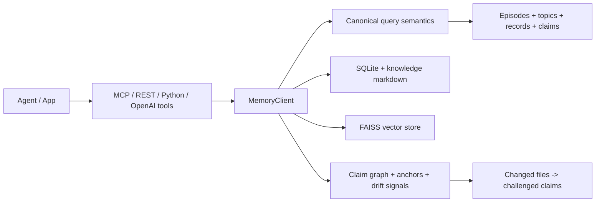

# consolidation-memory

[](https://pypi.org/project/consolidation-memory/)
[](https://github.com/charliee1w/consolidation-memory/releases)
[](https://github.com/charliee1w/consolidation-memory/actions)
[](https://pypi.org/project/consolidation-memory/)
[](LICENSE)
[](https://github.com/charliee1w/consolidation-memory/stargazers)

Local-first memory for coding agents that preserves provenance, temporal truth, and code-drift awareness.

`consolidation-memory` stores episodic events, consolidates them into structured knowledge, and serves the same trust-aware retrieval semantics across Python, MCP, REST, and OpenAI-style tool calls.

## Try It In 5 Minutes

```bash
pip install "consolidation-memory[fastembed]"
consolidation-memory init
consolidation-memory test
consolidation-memory serve
```

Pick `disabled` for the LLM step unless you already have LM Studio, Ollama, or OpenAI configured. That gives you a clean first-run path with local storage, recall, and MCP serving.

What that gives you immediately:

- Durable local storage with SQLite + FAISS
- A health check that validates the runtime end to end
- An MCP server that coding agents can connect to over stdio
- A clean path to REST, OpenAI-style tools, and scoped shared-memory use later

If you want runnable integration snippets instead of docs, start in [examples/](examples/README.md).

## Why It Is Different

| Capability | What `consolidation-memory` does |
| --- | --- |
| Local-first persistence | Stores memory on disk in inspectable SQLite, FAISS, markdown, and log artifacts |
| Trust-aware retrieval | Tracks temporal validity, contradictions, provenance, and claim lifecycle events |
| Drift-aware knowledge | Maps changed files to anchored claims and challenges impacted knowledge automatically |
| Shared memory without chaos | Supports namespace/project/app/agent/session scope dimensions with policy controls |
| Transport parity | Keeps MCP, REST, Python, and OpenAI-style tool semantics aligned |
| Builder ergonomics | Ships package metadata, release gates, examples, smoke tests, CI, and contributor docs |

## Architecture At A Glance



More detail lives in [docs/ARCHITECTURE.md](docs/ARCHITECTURE.md).

## Examples

The repo now keeps runnable or close-to-runnable examples in the root [examples/](examples/README.md) directory:

- [Python quickstart](examples/python-quickstart/quickstart.py)
- [REST API client](examples/rest-api/README.md)
- [Cursor MCP config](examples/cursor-integration/README.md)
- [Continue config](examples/continue-dev/README.md)
- [LangGraph memory node](examples/langgraph-memory-node/README.md)
- [Plugin hook example](examples/plugins/README.md)

Legacy raw config snippets still exist under [docs/examples/](docs/examples/).

## Backend Support

`consolidation-memory` supports both fully local and hosted setups.

| Layer | Supported backends | Recommended default | Local-only option |
| --- | --- | --- | --- |
| Embeddings | `fastembed`, `lmstudio`, `openai`, `ollama` | `fastembed` | `fastembed`, `lmstudio`, `ollama` |
| LLM consolidation | `lmstudio`, `openai`, `ollama`, `disabled` | `lmstudio` | `lmstudio`, `ollama`, `disabled` |

See [docs/MODEL_SUPPORT.md](docs/MODEL_SUPPORT.md) for the full matrix, defaults, and install notes.

## Privacy And Trust

- No built-in telemetry.
- Data is stored locally under `platformdirs.user_data_dir("consolidation_memory")`.
- Network calls only go to the embedding and LLM backends you configure.
- REST auth is required before non-loopback binds.
- The repo ships with tests, smoke checks, release gates, lint, type checks, and security scanning.

## Install

```bash
pip install "consolidation-memory[fastembed]"
```

Common extras:

- `consolidation-memory[rest]` for FastAPI endpoints
- `consolidation-memory[fastembed,rest]` for the default local REST setup
- `consolidation-memory[dashboard]` for the Textual dashboard
- `consolidation-memory[openai]` for the OpenAI SDK backend
- `consolidation-memory[all,dev]` for full local development

## Quick Start

```bash
consolidation-memory init
consolidation-memory test
consolidation-memory serve
```

`consolidation-memory` with no subcommand defaults to `serve`.

## CLI Commands

```text
serve            Start MCP server (default command)
serve --rest     Start REST API
init             Interactive setup
test             End-to-end health check
status           Runtime/system stats
consolidate      Trigger consolidation run
detect-drift     Challenge claims impacted by changed files
export           Export full snapshot JSON
import PATH      Import snapshot JSON
reindex          Rebuild vectors with current embedding backend
browse           Browse knowledge topics
setup-memory     Add reusable memory instructions to an agent file
dashboard        Launch Textual dashboard
```

## MCP Setup

```json
{
  "mcpServers": {
    "consolidation_memory": {
      "command": "/absolute/path/to/python",
      "args": ["-m", "consolidation_memory", "--project", "default", "serve"],
      "env": {
        "PYTHONUNBUFFERED": "1",
        "CONSOLIDATION_MEMORY_IDLE_TIMEOUT_SECONDS": "900"
      }
    }
  }
}
```

Prefer an exact Python interpreter over the `consolidation-memory` console script. It avoids PATH and env drift and is more reliable on Windows when MCP hosts restart the server.

The stdio MCP server now enforces one live server per parent process and project, and the recommended idle timeout is 900 seconds so leaked hosts self-clean instead of accumulating indefinitely. Set `CONSOLIDATION_MEMORY_IDLE_TIMEOUT_SECONDS=0` only if you explicitly need a never-exit server.

MCP tools exposed by `server.py`:

- `memory_store`
- `memory_recall`
- `memory_store_batch`
- `memory_search`
- `memory_claim_browse`
- `memory_claim_search`
- `memory_detect_drift`
- `memory_status`
- `memory_forget`
- `memory_export`
- `memory_correct`
- `memory_compact`
- `memory_consolidate`
- `memory_consolidation_log`
- `memory_decay_report`
- `memory_protect`
- `memory_timeline`
- `memory_contradictions`
- `memory_browse`
- `memory_read_topic`

## Python Example

```python
from consolidation_memory import MemoryClient

with MemoryClient(auto_consolidate=False) as mem:
    mem.store(
        "User prefers short PR summaries with concrete file paths.",
        content_type="preference",
        tags=["workflow", "reviews"],
    )

    result = mem.recall(
        "how should I format PR summaries?",
        n_results=5,
        include_knowledge=True,
    )

    print(len(result.episodes), len(result.knowledge), len(result.records), len(result.claims))
```

## REST API

Run:

```bash
pip install "consolidation-memory[fastembed,rest]"
consolidation-memory serve --rest --host 127.0.0.1 --port 8080
```

For non-loopback binds (for example `--host 0.0.0.0`), set auth first:

```bash
export CONSOLIDATION_MEMORY_REST_AUTH_TOKEN="change-me"
consolidation-memory serve --rest --host 0.0.0.0 --port 8080
```

```powershell
$env:CONSOLIDATION_MEMORY_REST_AUTH_TOKEN = "change-me"
consolidation-memory serve --rest --host 0.0.0.0 --port 8080
```

When auth is enabled, send `Authorization: Bearer <token>` on all endpoints except `/health`.

Endpoints:

- `GET /health`
- `POST /memory/store`
- `POST /memory/store/batch`
- `POST /memory/recall`
- `POST /memory/search`
- `POST /memory/claims/browse`
- `POST /memory/claims/search`
- `POST /memory/detect-drift`
- `GET /memory/status`
- `DELETE /memory/episodes/{episode_id}`
- `POST /memory/consolidate`
- `POST /memory/correct`
- `POST /memory/export`
- `POST /memory/compact`
- `GET /memory/browse`
- `GET /memory/topics/{filename}`
- `POST /memory/timeline`
- `POST /memory/contradictions`
- `POST /memory/protect`
- `POST /memory/consolidation-log`
- `GET /memory/decay-report`

## OpenAI-Compatible Tools

Use:

- `consolidation_memory.schemas.openai_tools`
- `consolidation_memory.schemas.dispatch_tool_call`

This keeps tool definitions and dispatch behavior aligned with the same semantics used by MCP and REST.

## Scope Model (Compatibility + Shared Use)

By default, existing single-project usage still works.

When a scope envelope is provided, records are persisted with explicit scope dimensions:

- `namespace_*`
- `project_*`
- `app_client_*`
- `agent_*`
- `session_*`

This allows selective sharing without mixing unrelated contexts.

Optional `scope.policy` controls:

- `read_visibility`: `private` (default), `project`, `namespace`
- `write_mode`: `allow` (default), `deny`

Persisted ACL entities are also supported (`access_policies`, `policy_principals`, `policy_acl_entries`).
When persisted ACL rows match the resolved scope and principal, they are authoritative over `scope.policy`.
Conflict rules: write `deny` overrides `allow`; read visibility resolves to the most restrictive level.

## Storage Layout

Data is under `platformdirs.user_data_dir("consolidation_memory")/projects/<project>/`.

```text
memory.db
faiss_index.bin
faiss_id_map.json
faiss_tombstones.json
.faiss_reload
knowledge/
knowledge/versions/
consolidation_logs/
backups/
```

## Configuration

Config file discovery:

1. `CONSOLIDATION_MEMORY_CONFIG`
2. Platform default config path
3. Built-in defaults

Every scalar field can be overridden with `CONSOLIDATION_MEMORY_<FIELD_NAME>`.

Examples:

```bash
CONSOLIDATION_MEMORY_PROJECT=work
CONSOLIDATION_MEMORY_EMBEDDING_BACKEND=fastembed
CONSOLIDATION_MEMORY_LLM_BACKEND=ollama
CONSOLIDATION_MEMORY_CONSOLIDATION_INTERVAL_HOURS=6
```

## Documentation Map

- [Architecture](docs/ARCHITECTURE.md)
- [Builder Baseline](docs/BUILDER_BASELINE.md)
- [Model Support](docs/MODEL_SUPPORT.md)
- [Release Gates](docs/RELEASE_GATES.md)
- [Novelty Metrics](docs/NOVELTY_METRICS.md)
- [Novelty Eval Guide](docs/NOVELTY_EVAL_GUIDE.md)
- [External Review Playbook](docs/EXTERNAL_REVIEW_PLAYBOOK.md)
- [Recommended Agent Instructions](docs/recommended-agent-instructions.md)
- [Universal-memory strategy docs](docs/strategy/)

## Development

```bash
git clone https://github.com/charliee1w/consolidation-memory
cd consolidation-memory
pip install -r requirements-dev.txt
python scripts/smoke_builder_base.py
pytest tests/ -q
pytest tests/ -q -W error::ResourceWarning
ruff check src/ tests/
mypy src/consolidation_memory/
bandit -q -r src scripts
```

## Community

- Contributors: [CONTRIBUTORS.md](CONTRIBUTORS.md)
- Issues: [GitHub Issues](https://github.com/charliee1w/consolidation-memory/issues)
- Discussions: [GitHub Discussions](https://github.com/charliee1w/consolidation-memory/discussions)
- Releases: [GitHub Releases](https://github.com/charliee1w/consolidation-memory/releases)

## License, Etc.

Project policies:

- [Security](SECURITY.md)
- [Contributing](CONTRIBUTING.md)
- [Code of Conduct](CODE_OF_CONDUCT.md)

MIT
