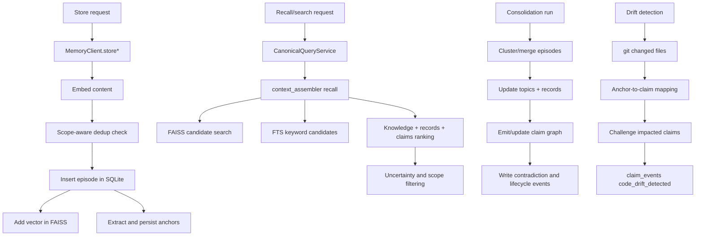

# Architecture

This document describes the current architecture of `consolidation-memory` as implemented in `src/consolidation_memory/`.

## Design Goals

- Local-first persistence with inspectable on-disk artifacts.
- Trust-preserving retrieval (temporal validity, provenance, contradiction visibility, drift challenge events).
- Single semantic contract across MCP, REST, Python, and OpenAI-compatible tools.
- Backward compatibility for single-project usage while supporting explicit shared scopes.

## Product Stance

`consolidation-memory` is designed as a trust layer for coding-agent memory.

- Claims are the reusable unit.
- Episodes are the raw evidence behind those claims.
- Reuse should degrade when provenance is weak, contradictions accumulate, or code drift challenges prior conclusions.
- Shared memory is only valuable when scope and policy make reuse safe.

## Runtime Surfaces

- CLI entrypoint: `cli.py`
- MCP server: `server.py`
- REST API: `rest.py`
- Python API: `client.py`
- OpenAI tool schemas/dispatch: `schemas.py`

All surfaces route to `MemoryClient` and canonical query semantics in `query_service.py`.

## Core Module Map

- `client.py`: orchestration, lifecycle, tool-facing operations, scope resolution.
- `client_runtime.py`: consolidation scheduler and backend health runtime helpers.
- `database.py`: SQLite schema/migrations and persistence operations.
- `vector_store.py`: FAISS wrapper, tombstones, compaction, reload signaling.
- `knowledge_consistency.py`: markdown/DB drift auditing for topic consistency.
- `markdown_records.py`: markdown-to-record parser used by correction/audits.
- `context_assembler.py`: hybrid recall across episodes/topics/records/claims.
- `query_service.py`: canonical query envelopes and service layer.
- `query_semantics.py`: shared trust filters (payload parse + scope filtering).
- `claim_graph.py`: deterministic claim canonicalization.
- `anchors.py`: anchor extraction from episode content.
- `drift.py`: git-based drift detection and claim challenge flow.
- `release_gates.py`: release gate evaluation logic.
- `plugins.py`: hook-based extension points.

## Data Flow



## Persistence Model

`database.py` uses `CURRENT_SCHEMA_VERSION = 17`.

Primary tables:

- `episodes`
- `knowledge_topics`
- `knowledge_records`
- `access_policies`
- `policy_principals`
- `policy_acl_entries`
- `claims`
- `claim_sources`
- `claim_edges`
- `claim_events`
- `episode_anchors`
- `action_outcomes`
- `action_outcome_sources`
- `action_outcome_refs`
- `contradiction_log`
- `consolidation_runs`
- `consolidation_metrics`
- `consolidation_scheduler`
- `tag_cooccurrence`
- `episodes_fts` (FTS5 virtual table)
- `schema_version`

Key points:

- Records and topics support temporal fields (`valid_from`, `valid_until` on records; event timeline for claims).
- Scope columns are persisted on episodes/topics/records for namespace/project/app/agent/session partitioning.
- Policy/ACL entities are first-class persisted rows:
  - `access_policies` define scope selectors (nullable fields behave as wildcards).
  - `policy_principals` define reusable principal identities.
  - `policy_acl_entries` bind principals to policy scopes with `write_mode` and/or `read_visibility`.
- FTS tables support keyword recall fallback and hybrid scoring.

## Retrieval Semantics

`context_assembler.recall()` combines:

- Semantic candidates from FAISS.
- Keyword candidates from FTS5 when enabled.
- Priority scoring using similarity + metadata signals.
- Knowledge topic search and typed record search.
- Claim search with temporal and scope filtering.
- Optional uncertainty signals (low confidence, recently contradicted).

The retrieval bias is deliberate: prefer reusable claims with provenance and uncertainty signals, while keeping episodes available as raw supporting evidence.

`query_service.py` wraps this behavior into canonical envelopes (`RecallQuery`, `EpisodeSearchQuery`, `ClaimBrowseQuery`, `ClaimSearchQuery`, `OutcomeBrowseQuery`, `DriftQuery`) so all external adapters use the same semantics.

## Vector Store Behavior

`vector_store.py` guarantees:

- Thread-safe operations via a lock.
- Cross-process single-writer FAISS mutations via `.faiss_write.lock` lease.
- Atomic persistence (`os.replace`) for index/id-map/tombstones.
- Tombstone-based deletions + compaction rebuild.
- Reload signaling (`.faiss_reload`) for multi-process consistency.
- Optional flat-to-IVF upgrade when index size crosses configured threshold.

## Consistency Guardrails

Knowledge data has dual persistence surfaces (markdown files + structured DB rows).
To keep them in sync:

- `knowledge_consistency.py` computes markdown/record consistency ratio.
- `MemoryClient.status()` returns `knowledge_consistency` details.
- `MemoryClient.status()` returns `trust_profile` details for claim coverage, provenance coverage, anchor coverage, contradiction pressure, and drift-watch posture.
- Health degrades when consistency drops below `KNOWLEDGE_CONSISTENCY_THRESHOLD` (default `0.995`).

## Scaling Envelope

Current FAISS behavior is tuned for local-first deployment:

- Default IVF upgrade threshold: `FAISS_IVF_UPGRADE_THRESHOLD = 10_000`.
- Platform review threshold: `FAISS_PLATFORM_REVIEW_THRESHOLD = 100_000`.
- `MemoryClient.status()` returns `scaling` advisories and index type.

When vector count crosses the platform review threshold, status/health report that a
larger-scale concurrency/indexing pass is due.

## Consolidation and Scheduler

`MemoryClient` runs consolidation manually or via background scheduling.

Important controls (from `config.py`):

- `CONSOLIDATION_AUTO_RUN`
- `CONSOLIDATION_INTERVAL_HOURS`
- `CONSOLIDATION_MAX_DURATION`
- `CONSOLIDATION_UTILITY_THRESHOLD`
- `CONSOLIDATION_UTILITY_WEIGHTS`

Scheduler state is persisted in `consolidation_scheduler` to support deterministic lease/trigger behavior.

## Trust and Safety Controls

- Prompt-safety sanitization before LLM extraction/merge prompts.
- Structured output validation for extracted records.
- Temporal querying (`as_of`) for records and claims.
- Explicit contradiction tracking in `contradiction_log` and claim events.
- Drift challenge workflow that writes auditable `code_drift_detected` events.
- Path traversal guards for topic read operations.

## Scope and Compatibility

Default behavior remains compatible with legacy single-project usage.

When scope is provided, writes include canonical scope metadata and reads apply scope filters. Shared namespace modes can intentionally widen visibility while keeping private defaults available.

Policy precedence and conflict semantics:

- `scope.policy` remains supported for backward compatibility.
- Persisted ACL entries are authoritative when present for the resolved scope/principal.
- Write conflicts use deny-overrides-allow (`deny` wins).
- Read visibility conflicts resolve to the most restrictive level (`private` < `project` < `namespace`).

## How To Verify This Document

Run these checks against live code:

```bash
python -m consolidation_memory --help
python -m consolidation_memory serve --help
python - <<'PY'
from consolidation_memory import __version__
from consolidation_memory.database import CURRENT_SCHEMA_VERSION
print(__version__, CURRENT_SCHEMA_VERSION)
PY
```

And inspect:

- `src/consolidation_memory/database.py`
- `src/consolidation_memory/client.py`
- `src/consolidation_memory/query_service.py`
- `src/consolidation_memory/context_assembler.py`
