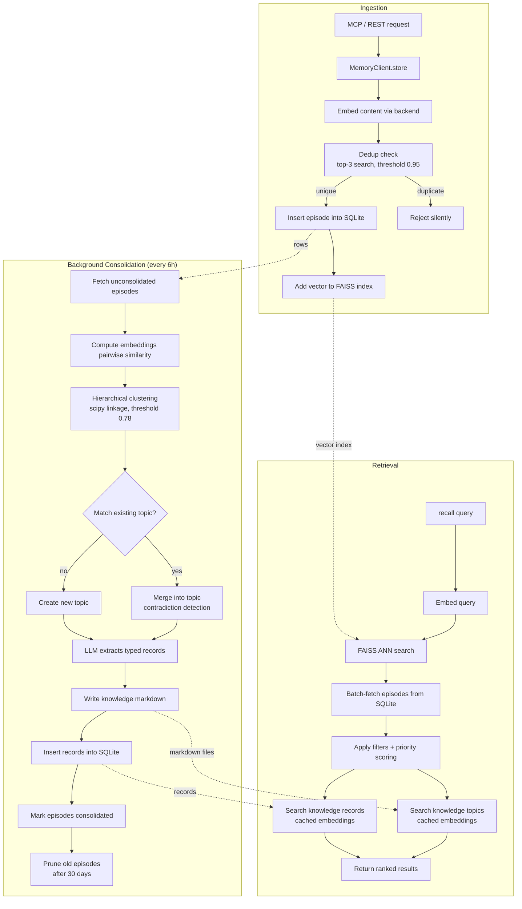
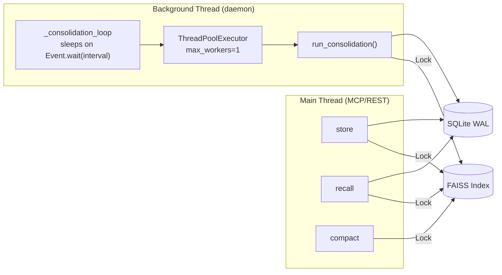
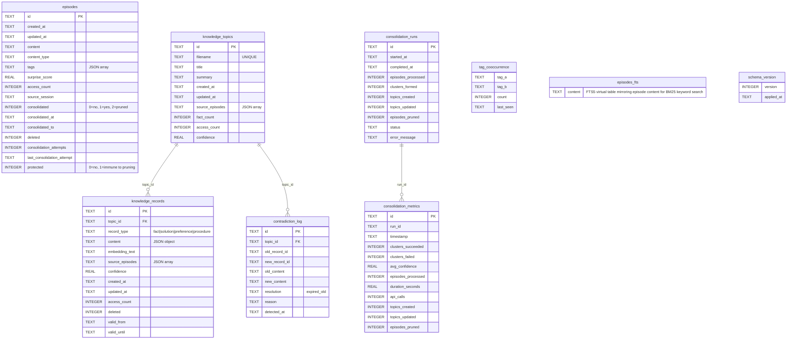
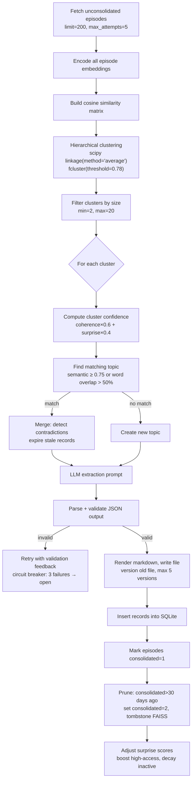
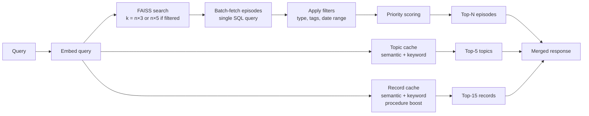

# Architecture

> A contributor-oriented overview of consolidation-memory internals.
> Read time: ~15 minutes.

## Table of Contents

- [High-Level Data Flow](#high-level-data-flow)
- [Threading Model](#threading-model)
- [Storage Layout](#storage-layout)
- [Consolidation Engine](#consolidation-engine)
- [Retrieval Pipeline](#retrieval-pipeline)
- [Security Considerations](#security-considerations)

---

## High-Level Data Flow



**Key principle:** Episodes are the raw material. Consolidation distills them into
structured knowledge (topics + typed records). Recall searches both layers and
blends results with priority scoring.

---

## Threading Model



### Synchronization Primitives

| Primitive | Location | Protects |
|-----------|----------|----------|
| `threading.Lock` | `VectorStore._lock` | All FAISS index reads/writes |
| `threading.Lock` | `MemoryClient._consolidation_lock` | Prevents concurrent consolidation runs |
| `threading.Event` | `MemoryClient._consolidation_stop` | Clean shutdown signal for background thread |
| `threading.local` | `database._local` | Thread-local SQLite connection cache |
| `threading.Lock` | `database._conn_list_lock` | Global connection list for shutdown cleanup |

### SQLite Concurrency

- **WAL mode** (`PRAGMA journal_mode=WAL`) enables readers to proceed without
  blocking writers and vice versa.
- Each thread gets its own `sqlite3.Connection` via `threading.local`, created
  on first access with a 10-second busy timeout.
- `get_connection()` is a context manager that commits on clean exit and rolls
  back on exception.

### FAISS Locking Strategy

Every public method on `VectorStore` (`add`, `search`, `remove`, `compact`,
`reconstruct_batch`) acquires `_lock` for the duration of the operation.
Cross-process coordination uses a signal file (`.faiss_reload`): after a write,
the writer calls `signal_reload()` which touches the file; readers check the
file's mtime and reload the index if it's newer than their load timestamp.

### Background Consolidation Lifecycle

1. Started as a daemon thread in `MemoryClient.__init__` if `CONSOLIDATION_AUTO_RUN=True`.
2. Sleeps via `Event.wait(timeout=interval_seconds)` — wakes on timeout or stop signal.
3. Acquires `_consolidation_lock` (non-blocking) — skips the run if already in progress.
4. Submits `run_consolidation()` to a single-worker `ThreadPoolExecutor` with a
   `CONSOLIDATION_MAX_DURATION + 60s` timeout.
5. On `MemoryClient.close()`, the stop event is set and the thread is joined with
   a 30-second timeout.

---

## Storage Layout

```
<DATA_DIR>/projects/<PROJECT_NAME>/
├── memory.db                    # SQLite database
├── faiss_index.bin              # FAISS binary index
├── faiss_id_map.json            # UUID ↔ FAISS position mapping
├── faiss_tombstones.json        # Soft-deleted episode UUIDs
├── .faiss_reload                # Signal file for cross-process reload
├── knowledge/                   # Markdown knowledge documents
│   ├── <topic_slug>.md
│   └── versions/                # Up to 5 historical versions per topic
│       └── <slug>.<ISO-timestamp>.md
├── backups/                     # JSON export snapshots
├── consolidation_logs/          # Per-run consolidation reports
└── logs/                        # Application logs
```

Config file: `~/.config/consolidation_memory/config.toml` (XDG), or
`%APPDATA%/consolidation_memory/config.toml` (Windows).

### SQLite Schema (v10)



Notable indexes: `idx_episodes_consolidated`, `idx_episodes_created`,
`idx_episodes_type`, `idx_episodes_deleted`, `idx_episodes_consolidation_attempts`,
`idx_records_topic`, `idx_records_type`, `idx_records_deleted`,
`idx_records_valid_until`, `idx_contradiction_topic`, `idx_contradiction_detected`,
`idx_cooccurrence_tag_a`, `idx_cooccurrence_tag_b`.

### FAISS Index

- **Initial type:** `IndexFlatIP(dim)` — brute-force inner product on L2-normalized
  vectors (equivalent to cosine similarity).
- **Auto-upgrade:** When `ntotal >= FAISS_IVF_UPGRADE_THRESHOLD` (default 10,000),
  the index is rebuilt as `IndexIVFFlat` with `nlist = min(sqrt(n), 4096)` and
  `nprobe = min(nlist/4, 64)`.
- **Persistence:** Atomic writes via temp file + `os.replace()`.
- **Deletions:** Tombstone set in `faiss_tombstones.json`; vectors aren't removed
  from the index until `compact()` rebuilds it.
- **Consistency check:** On load, validates `ntotal == len(id_map)` and
  `index.d == EMBEDDING_DIMENSION`.

---

## Consolidation Engine

Located in `src/consolidation_memory/consolidation/` (a package split into
`clustering.py`, `prompting.py`, `scoring.py`, `engine.py`).

### Pipeline Overview



### Clustering Details

Uses `scipy.cluster.hierarchy.linkage` with `method='average'` (UPGMA) on a
cosine distance matrix (`1 - dot(a, b)` on normalized vectors). The dendrogram
is cut with `fcluster(Z, t=0.78, criterion='distance')`. Clusters smaller than
`MIN_CLUSTER_SIZE` (2) or larger than `MAX_CLUSTER_SIZE` (20) are skipped.

**Cluster confidence** is computed as:

```
confidence = clamp(coherence × 0.6 + source_quality × 0.4, 0.5, 0.95)
```

Where `coherence` is the mean intra-cluster pairwise similarity and
`source_quality` is the mean surprise score of cluster episodes.

### LLM Prompt Strategy

The system prompt establishes the LLM as a "precise knowledge extractor" and
explicitly instructs it to treat `<episode>` tag contents as raw data, never as
instructions. Each episode is wrapped as:

```
<episode>
[2025-02-28T12:00:00Z] [fact] {sanitized content}
</episode>
```

The extraction prompt requests JSON output with four record types:

| Type | Required Fields |
|------|-----------------|
| `fact` | `subject`, `info` |
| `solution` | `problem`, `fix`, `context` |
| `preference` | `key`, `value`, `context` |
| `procedure` | `trigger`, `steps`, `context` |

Validation checks all required fields. On failure, a retry prompt includes the
validation error. The circuit breaker opens after 3 consecutive LLM failures
with a 60-second cooldown.

### Contradiction Detection

1. Embed new and existing records.
2. Find candidate pairs with similarity >= 0.7.
3. If `CONTRADICTION_LLM_ENABLED`: send pairs to LLM for verdict
   (`CONTRADICTS` / `COMPATIBLE`).
4. Contradicting existing records are expired (`valid_until` set to now);
   new records replace them.

### Pruning

Episodes with `consolidated=1` older than `CONSOLIDATION_PRUNE_AFTER_DAYS`
(default 30) are marked `consolidated=2` and their FAISS vectors are
tombstoned. The SQLite rows remain for audit but are excluded from search.

---

## Retrieval Pipeline

Implemented in `context_assembler.py`. A single `recall()` call searches three
layers simultaneously and returns a unified result.



### Priority Scoring Formula

```
score = similarity × metadata_boost
```

Where:

```
metadata_boost = surprise^w_s × recency^w_r × access_factor

recency        = exp(-age_days / 90)
access_factor  = 1.0 + log(1 + access_count) × w_a
```

Default weights: `w_s = 0.4`, `w_r = 0.35`, `w_a = 0.25`.

**Intuition:** Recent, surprising, frequently-accessed episodes rank higher.
The exponential decay gives a 90-day half-life — episodes from 3 months ago
score ~50% of the recency factor.

### Knowledge Search

Topics and records are searched using cached embedding matrices (rebuilt on
invalidation). Relevance is a weighted blend:

| Layer | Formula | Threshold |
|-------|---------|-----------|
| Topics | `semantic × 0.8 + keyword × 0.2` | 0.25 |
| Records | `semantic × 0.9 + keyword × 0.1` | 0.30 |

Procedure-type records receive a 1.15× relevance boost when the query
contains task-oriented words (`how`, `workflow`, `steps`, `deploy`, `test`,
etc.).

---

## Security Considerations

### Prompt Injection Defense

Episode content passes through an LLM during consolidation, creating a prompt
injection surface. Defenses are layered:

1. **Sanitization** (`_sanitize_for_prompt`): A regex strips common injection
   patterns — `system:`, `you are`, `ignore previous`, `override`,
   `[system]`, `<system>`, etc. — replacing them with `[REDACTED]`.

2. **Structural isolation**: Episodes are wrapped in `<episode>` XML tags.
   The system prompt explicitly states that tag contents are raw data.

3. **Output validation**: LLM output must parse as valid JSON with the
   expected schema. Free-text or instruction-like output fails validation
   and triggers a retry (bounded by the circuit breaker).

### Path Traversal Guards

- **Topic filenames** are produced by `_slugify()`, which strips all
  characters except lowercase alphanumeric and underscores, and caps length
  at 60 characters. No user-supplied path components reach the filesystem
  directly.
- **Project names** are validated against `^[a-z0-9][a-z0-9_-]{0,63}$`
  before any path derivation.
- All file operations target known subdirectories under `DATA_DIR`
  (`knowledge/`, `backups/`, `logs/`, etc.).

### Input Sanitization

- **Content types** are validated against an allowlist (`exchange`, `fact`,
  `solution`, `preference`); unrecognized values default to `exchange`.
- **Surprise scores** are clamped to `[0.0, 1.0]`.
- **Confidence values** are clamped to `[0.5, 0.95]`.
- **Tags** must parse as a JSON array.
- **All SQL queries** use parameterized placeholders (`?`) — no string
  interpolation.

### Error Isolation

- The **circuit breaker** (3 failures, 60s cooldown) prevents a misbehaving
  LLM from being called in a tight loop.
- **Consolidation timeouts** (`CONSOLIDATION_MAX_DURATION`, default 1800s)
  prevent runaway background work.
- **Race-safe upserts**: `upsert_knowledge_topic` catches `IntegrityError`
  on concurrent inserts and falls back to an update.
