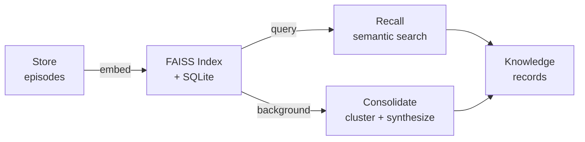
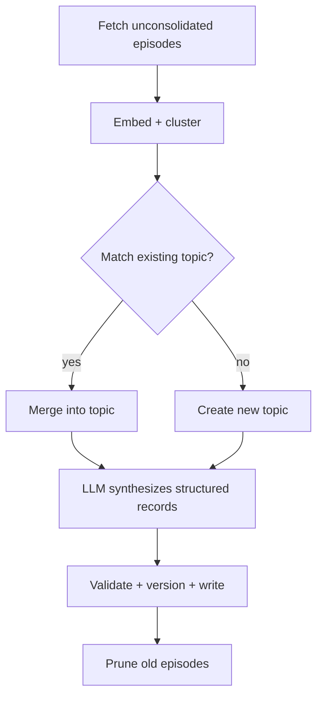

# README Overhaul Implementation Plan

> **For Claude:** REQUIRED SUB-SKILL: Use superpowers:executing-plans to implement this plan task-by-task.

**Goal:** Rewrite README.md as a best-in-class open source README using GitHub-native Markdown.

**Architecture:** Single-file replacement of `README.md`. Pure GitHub-flavored Markdown + inline HTML + Mermaid diagrams. No external assets or build steps.

**Tech Stack:** Markdown, HTML (inline), Mermaid, shield.io badges

**Design doc:** `docs/plans/2026-02-28-readme-overhaul-design.md`

---

### Task 1: Write the complete README.md

**Files:**
- Modify: `README.md` (full replacement)

**Step 1: Replace README.md with the new content**

The new README follows this exact structure. Write the entire file:

**Section 1 — Hero (centered)**
```markdown
<div align="center">

# consolidation-memory

**Your AI forgets everything between sessions. This fixes that.**

A local-first memory system that stores, retrieves, and *consolidates* knowledge across conversations — automatically.

[](https://pypi.org/project/consolidation-memory/)
[](https://github.com/charliee1w/consolidation-memory/actions)
[](https://pypi.org/project/consolidation-memory/)
[](LICENSE)

</div>
```

**Section 2 — Conversation example**
Keep the existing example block almost verbatim — it's excellent. Just wrap it in a slightly tighter format. No changes to the content.

**Section 3 — How It Works (Mermaid diagram)**
Replace the ASCII art with a Mermaid flowchart:
```
## How It Works



Followed by the three numbered descriptions:
1. **Store** — Save episodes (facts, solutions, preferences) with embeddings into SQLite + FAISS
2. **Recall** — Semantic search with priority scoring (surprise, recency, access frequency)
3. **Consolidate** — Background LLM clusters related episodes and synthesizes structured knowledge records
```

**Section 4 — Quick Start**
```markdown
## Quick Start

```bash
pip install consolidation-memory[fastembed]
consolidation-memory init
```

FastEmbed runs locally — no external services needed.
```

**Section 5 — Integrations**
Use `<details>` for each integration. MCP Server is `open` by default:

```markdown
## Integrations

<details open>
<summary><strong>MCP Server</strong> — Claude Desktop / Claude Code / Cursor</summary>

Add to your MCP config:

```json
{
  "mcpServers": {
    "consolidation_memory": {
      "command": "consolidation-memory"
    }
  }
}
```

Ten tools become available:

| Tool | Purpose |
|------|---------|
| `memory_store` | Save an episode (fact, solution, preference, exchange) |
| `memory_store_batch` | Store multiple episodes in one call |
| `memory_recall` | Semantic search with optional filters |
| `memory_search` | Keyword/metadata search (no embedding needed) |
| `memory_status` | System stats + health diagnostics |
| `memory_forget` | Soft-delete an episode |
| `memory_export` | Export everything to JSON |
| `memory_correct` | Fix outdated knowledge documents |
| `memory_compact` | Remove FAISS tombstones, rebuild index |
| `memory_consolidate` | Trigger consolidation manually |

</details>

<details>
<summary><strong>Python API</strong></summary>

```python
from consolidation_memory import MemoryClient

with MemoryClient() as mem:
    mem.store("User prefers dark mode", content_type="preference", tags=["ui"])

    result = mem.recall("user interface preferences")
    for ep in result.episodes:
        print(ep["content"], ep["similarity"])

    stats = mem.status()
    print(stats.health)
```

</details>

<details>
<summary><strong>OpenAI Function Calling</strong></summary>

Works with any OpenAI-compatible API (LM Studio, Ollama, OpenAI, Azure):

```python
from consolidation_memory import MemoryClient
from consolidation_memory.schemas import openai_tools, dispatch_tool_call

mem = MemoryClient()
# Pass openai_tools to your chat completion, dispatch results with dispatch_tool_call()
```

</details>

<details>
<summary><strong>REST API</strong></summary>

```bash
pip install consolidation-memory[rest]
consolidation-memory serve --rest --port 8080
```

| Method | Path | Description |
|--------|------|-------------|
| `GET` | `/health` | Version + status |
| `POST` | `/memory/store` | Store episode |
| `POST` | `/memory/store/batch` | Store multiple episodes |
| `POST` | `/memory/recall` | Semantic search |
| `POST` | `/memory/search` | Keyword/metadata search |
| `GET` | `/memory/status` | System statistics |
| `DELETE` | `/memory/episodes/{id}` | Forget episode |
| `POST` | `/memory/consolidate` | Trigger consolidation |
| `POST` | `/memory/correct` | Correct knowledge doc |
| `POST` | `/memory/export` | Export to JSON |

</details>
```

**Section 6 — How Consolidation Works (Mermaid)**
```markdown
## How Consolidation Works



Runs on a background thread (default: every 6 hours). Episodes are grouped by hierarchical clustering, matched to existing knowledge topics by semantic similarity, then synthesized into structured records (facts, solutions, preferences) via LLM. Three consecutive failures trigger a circuit breaker to avoid burning through timeouts.
```

**Section 7 — Backends**
```markdown
## Backends

### Embedding

| Backend | Install | Model | Local |
|---------|---------|-------|:-----:|
| **FastEmbed** | `pip install consolidation-memory[fastembed]` | bge-small-en-v1.5 | Yes |
| LM Studio | Built-in | nomic-embed-text-v1.5 | Yes |
| Ollama | Built-in | nomic-embed-text | Yes |
| OpenAI | `pip install consolidation-memory[openai]` | text-embedding-3-small | No |

### LLM (for consolidation)

| Backend | Requirements |
|---------|-------------|
| **LM Studio** | LM Studio running with any chat model |
| Ollama | Ollama running with any chat model |
| OpenAI | API key |
| Disabled | None — store/recall only, no consolidation |
```

**Section 8 — Configuration (collapsible)**
```markdown
## Configuration

```bash
consolidation-memory init  # Interactive setup
```

<details>
<summary>Manual configuration</summary>

| Platform | Path |
|----------|------|
| Linux/macOS | `~/.config/consolidation_memory/config.toml` |
| Windows | `%APPDATA%\consolidation_memory\config.toml` |
| Override | `CONSOLIDATION_MEMORY_CONFIG` env var |

```toml
[embedding]
backend = "fastembed"

[llm]
backend = "lmstudio"
api_base = "http://localhost:1234/v1"
model = "qwen2.5-7b-instruct"

[consolidation]
auto_run = true
interval_hours = 6
cluster_threshold = 0.72
prune_enabled = true
prune_after_days = 60
```

</details>
```

**Section 9 — CLI**
```markdown
## CLI

| Command | Description |
|---------|-------------|
| `consolidation-memory serve` | Start MCP server (default) |
| `consolidation-memory serve --rest` | Start REST API server |
| `consolidation-memory init` | Interactive setup |
| `consolidation-memory status` | Show system stats |
| `consolidation-memory consolidate` | Manual consolidation |
| `consolidation-memory export` | Export to JSON |
| `consolidation-memory import PATH` | Import from JSON |
| `consolidation-memory reindex` | Re-embed everything |
```

**Section 10 — Data Storage (collapsible)**
```markdown
## Data Storage

All data stays local.

| Platform | Path |
|----------|------|
| Linux | `~/.local/share/consolidation_memory/` |
| macOS | `~/Library/Application Support/consolidation_memory/` |
| Windows | `%LOCALAPPDATA%\consolidation_memory\` |

Override with `data_dir` under `[paths]` in config.

<details>
<summary>Migrating</summary>

Point your config at an existing data directory:

```toml
[paths]
data_dir = "/path/to/your/existing/data"
```

Switching embedding backends (different dimensions)?

```bash
consolidation-memory reindex
```

</details>
```

**Section 11 — Development**
```markdown
## Development

```bash
git clone https://github.com/charliee1w/consolidation-memory
cd consolidation-memory
pip install -e ".[all,dev]"
pytest tests/ -v
ruff check src/ tests/
```
```

**Section 12 — License**
```markdown
## License

MIT
```

**Step 2: Review the rendered output**

Verify on GitHub that:
- Badges render with the dark monochrome palette
- Mermaid diagrams render correctly
- `<details>` sections collapse/expand
- All links work
- Tool count is accurate (10 tools)
- No broken markdown

**Step 3: Commit**

```bash
git add README.md
git commit -m "docs: complete README overhaul

Restructured with centered hero, dark monochrome badges, Mermaid
architecture diagrams, collapsible integration sections, and
corrected tool count (10 tools). Scannable narrative flow with
dense reference content in collapsible blocks."
```
