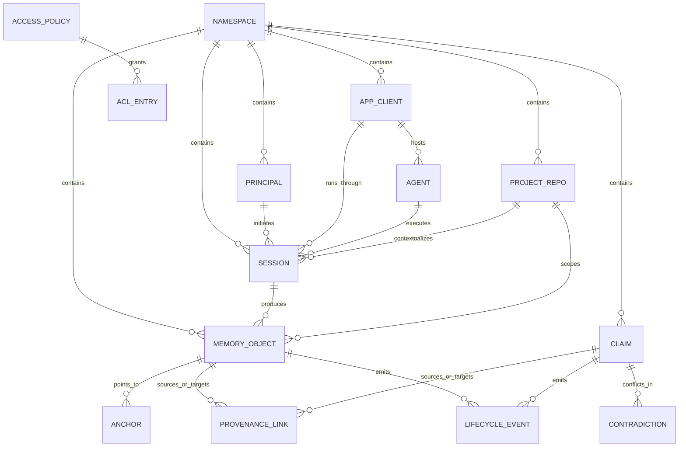

# Canonical Memory Object Model

Date: 2026-03-07
Status: Proposed

## Purpose

Define the canonical data model for turning `consolidation-memory` from a project-scoped memory engine into a universal, model-agnostic shared memory system for agents and apps without weakening the repo's current trust semantics:

- temporal recall
- provenance and source traceability
- contradiction handling
- drift-aware invalidation
- local-first inspectability

This document defines the target domain model. It does not change product code.

## Assumptions

1. Backward compatibility for current single-project installs remains mandatory through the first implementation phases.
2. Shared memory is explicit and opt-in. Isolation remains the default.
3. "Universal" means shared data-model compatibility across agent ecosystems, not sharing prompts or hidden model state.
4. Local-first and self-hosted remain supported deployment modes even after shared scopes are introduced.
5. Markdown knowledge topics remain useful human-facing projections, but they are not the canonical shared-memory boundary.

## External Alignment Inputs

The model below intentionally separates session state from durable shared memory because the main external ecosystems already make that distinction in different ways:

- OpenAI Agents SDK sessions are per-session conversation histories reused across runs and can be shared by multiple agents when they point at the same backing session store. Official docs: [Sessions](https://openai.github.io/openai-agents-python/sessions/)
- LangGraph persists per-thread state with a checkpointer and uses a separate store for memory shared across threads, namespaced by an arbitrary tuple such as `(<user_id>, "memories")`. Official docs: [Persistence](https://docs.langchain.com/oss/python/langgraph/persistence)
- Google ADK separates short-term `Session` / `State` from long-term searchable knowledge through `MemoryService`, with examples keyed by `app_name`, `user_id`, and `session_id`. Official docs: [ADK Memory](https://google.github.io/adk-docs/sessions/memory/)
- Letta treats persisted memory blocks as shareable durable objects that can be attached to multiple agents; direct block updates replace the full value and concurrent writers are last-write-wins. Official docs: [Memory blocks](https://docs.letta.com/guides/core-concepts/memory/memory-blocks)

These patterns imply that the canonical model must have first-class concepts for namespace, app, agent, principal, session, and durable memory artifacts, instead of collapsing all state into one "project" or one conversation log.

## Design Principles

1. Separate interaction context from durable memory.
2. Treat trust metadata as first-class data, not decorator fields.
3. Preserve one canonical identity for each memory artifact even when multiple projections exist.
4. Keep adapter-specific identifiers at the edges, not in the core model.
5. Make policy and scope explicit instead of relying on filesystem isolation alone.
6. Prefer additive migration over table replacement until the new service layer is in place.

## Canonical Entities

### 1. Namespace

The top-level durable boundary for intentional sharing.

Required fields:

- `id`
- `slug`
- `display_name`
- `sharing_mode` (`private`, `shared`, `team`, `managed`)
- `default_policy_id`
- `created_at`
- `updated_at`

Rules:

- Every durable entity except global config belongs to exactly one namespace.
- The current `active_project` concept becomes a client-side default resolver, not the top-level durable boundary.

### 2. Principal

The actor identity on whose behalf reads and writes occur.

Required fields:

- `id`
- `namespace_id`
- `principal_type` (`human`, `service`, `system`)
- `display_name`
- `external_subject`
- `status`
- `created_at`

Rules:

- Principals answer "who wrote this?" and "who can read this?" once ACLs exist.
- A single local install may initially backfill one synthetic principal such as `local_owner`.

### 3. AppClient

The integration surface or application that is using the memory system.

Required fields:

- `id`
- `namespace_id`
- `app_type` (`mcp`, `python_sdk`, `rest`, `openai_agents`, `langgraph`, `adk`, `letta`, `cli`, `other`)
- `name`
- `provider`
- `external_key`
- `trust_mode`
- `created_at`

Rules:

- App identity is distinct from principal identity.
- Adapter-specific metadata lives here, not on the core memory objects.

### 4. Agent

The logical agent or worker identity operating inside an app.

Required fields:

- `id`
- `namespace_id`
- `app_id`
- `name`
- `external_key`
- `model_provider`
- `model_name`
- `status`
- `created_at`

Rules:

- Multiple agents may exist under one app.
- Agents are optional for writes from generic SDK or REST callers.

### 5. Session

The short-term interaction or workflow context.

Required fields:

- `id`
- `namespace_id`
- `app_id`
- `agent_id` (nullable)
- `principal_id` (nullable)
- `project_id` (nullable)
- `external_key`
- `session_kind` (`conversation`, `thread`, `workflow`, `job`)
- `started_at`
- `ended_at` (nullable)
- `status`

Rules:

- Sessions are not the same thing as long-term memory.
- A session may produce many memory objects and many lifecycle events.
- OpenAI session IDs, LangGraph thread IDs, and ADK session IDs all map here.

### 6. ProjectRepo

The repository or workspace context currently approximated by `active_project`.

Required fields:

- `id`
- `namespace_id`
- `slug`
- `display_name`
- `root_uri`
- `repo_remote`
- `default_branch`
- `status`
- `created_at`

Rules:

- Project becomes one scope component, not the only durable namespace.
- Multiple sessions and agents can share the same project context.

### 7. MemoryObject

The canonical durable memory artifact. This is the new universal identity layer.

Required fields:

- `id`
- `namespace_id`
- `memory_kind` (`episode`, `knowledge_record`, `shared_block`, `artifact`, `imported_memory`)
- `semantic_kind` (`exchange`, `fact`, `solution`, `preference`, `procedure`, `other`)
- `project_id` (nullable)
- `session_id` (nullable)
- `principal_id` (nullable)
- `app_id` (nullable)
- `agent_id` (nullable)
- `payload_ref_kind`
- `payload_ref_id`
- `status`
- `valid_from`
- `valid_until` (nullable)
- `created_at`
- `updated_at`
- `policy_id`

Rules:

- This is the canonical ID that adapters target.
- The payload can still live in specialized tables such as `episodes` or `knowledge_records`.
- One memory object points to exactly one payload row, but a payload row may remain readable without the new registry during migration.

### 8. Claim

The normalized assertion layer used for trust, recall quality, and contradiction handling.

Required fields:

- `id`
- `namespace_id`
- `claim_type`
- `canonical_text`
- `payload`
- `status`
- `confidence`
- `valid_from`
- `valid_until` (nullable)
- `created_at`
- `updated_at`
- `policy_id`

Rules:

- Claims are not raw memories. They are normalized assertions derived from or attached to memories.
- Claims may outlive the sessions that produced their evidence.

### 9. ProvenanceLink

The generalized evidence and derivation edge.

Required fields:

- `id`
- `namespace_id`
- `link_type` (`derived_from`, `asserted_by`, `supported_by`, `materialized_as`, `supersedes`, `observed_in`)
- `source_memory_id` (nullable)
- `source_claim_id` (nullable)
- `target_memory_id` (nullable)
- `target_claim_id` (nullable)
- `details`
- `confidence`
- `created_at`

Rules:

- This generalizes the current `claim_sources` shape.
- Provenance is append-only. Corrections add links and events; they do not erase history.

### 10. Anchor

An extracted pointer into external artifacts used for trust and drift workflows.

Required fields:

- `id`
- `namespace_id`
- `memory_id`
- `anchor_type` (`file_path`, `commit`, `tool_ref`, `url`, `document_span`, `other`)
- `anchor_value`
- `locator`
- `created_at`

Rules:

- Anchors should attach to any memory object, not only episodes.
- Drift workflows remain repo-aware, but the anchor model must also support non-repo artifacts.

### 11. Contradiction

The append-only contradiction record.

Required fields:

- `id`
- `namespace_id`
- `left_claim_id` (nullable)
- `right_claim_id` (nullable)
- `left_memory_id` (nullable)
- `right_memory_id` (nullable)
- `resolution`
- `reason`
- `detected_at`
- `resolved_at` (nullable)
- `resolved_by_event_id` (nullable)

Rules:

- Contradictions must remain queryable and auditable.
- A contradiction record is evidence of system reasoning, not a transient runtime warning.

### 12. LifecycleEvent

The append-only audit event for state transitions.

Required fields:

- `id`
- `namespace_id`
- `subject_type` (`memory`, `claim`, `session`, `policy`, `project`)
- `subject_id`
- `event_type`
- `actor_principal_id` (nullable)
- `actor_app_id` (nullable)
- `actor_agent_id` (nullable)
- `details`
- `created_at`

Rules:

- The trust layer should answer "what changed, when, and because of whom/what?"
- Existing `claim_events` are a subset of this broader event model.

### 13. AccessPolicy and ACLEntry

The policy model for read/write boundaries.

Required `AccessPolicy` fields:

- `id`
- `namespace_id`
- `policy_mode` (`private`, `namespace_shared`, `project_shared`, `app_shared`, `custom`)
- `inherit_parent`
- `created_at`
- `updated_at`

Required `ACLEntry` fields:

- `id`
- `policy_id`
- `subject_type` (`principal`, `app`, `agent`, `namespace_role`)
- `subject_id`
- `permissions`
- `effect`

Rules:

- Namespace and object-level policy must be explicit.
- Default mode is deny outside the owning namespace unless policy grants access.

## Canonical Scope Envelope

Every write and every recall should resolve a scope envelope before data access:

- `namespace_id` (required after migration)
- `project_id` (optional)
- `principal_id` (optional)
- `app_id` (optional)
- `agent_id` (optional)
- `session_id` (optional)

Resolution rules:

1. Namespace is mandatory in the target model.
2. Legacy installs resolve to namespace `default`.
3. Legacy `active_project` resolves to a default `ProjectRepo` within the resolved namespace.
4. Session identity narrows interaction history; it does not replace namespace or project scope.
5. ACL evaluation happens after scope resolution, not before.

## Relationship Model

## Current Schema To Canonical Model Mapping

| Current table or concept | Current role | Canonical role | Decision |
| --- | --- | --- | --- |
| `episodes` | Raw stored session artifacts | `MemoryObject(kind=episode)` payload table | Survive and evolve |
| `knowledge_topics` | Human-readable consolidated topic docs | Inspectable projection / collection | Survive and evolve |
| `knowledge_records` | Structured consolidated knowledge | `MemoryObject(kind=knowledge_record)` payload table | Survive and evolve |
| `claims` | Normalized assertions | `Claim` | Survive with scope and policy fields |
| `claim_edges` | Claim relationship graph | Claim graph edges | Survive |
| `claim_sources` | Claim evidence links | `ProvenanceLink` | Evolve |
| `claim_events` | Claim lifecycle audit | `LifecycleEvent(subject_type=claim)` | Evolve |
| `episode_anchors` | Episode-only anchors | `Anchor` | Evolve |
| `contradiction_log` | Contradiction audit log | `Contradiction` | Evolve |
| `consolidation_runs` | Operational run audit | Operational lifecycle/event support | Survive |
| `consolidation_metrics` | Operational metrics | Operational metrics | Survive |
| `tag_cooccurrence` | Ranking aid | Ranking aid | Survive |
| `schema_version` | Migration ledger | Migration ledger | Survive |
| `Config.active_project` | Global project selector | Client-side default `ProjectRepo` resolver | De-scope from core domain |
| `episodes.source_session` | Loose session identifier | `Session.external_key` | Backfill into first-class session rows |

## Survive, Evolve, New

### Survive largely intact

- `claims`
- `claim_edges`
- `consolidation_runs`
- `consolidation_metrics`
- `tag_cooccurrence`
- `schema_version`

### Survive with additive evolution

- `episodes`
- `knowledge_topics`
- `knowledge_records`
- `claim_sources`
- `claim_events`
- `episode_anchors`
- `contradiction_log`

### New canonical entities to add

- `namespaces`
- `principals`
- `app_clients`
- `agents`
- `sessions`
- `projects`
- `memory_objects`
- `access_policies`
- `acl_entries`
- generalized `provenance_links`
- generalized `anchors`
- generalized `lifecycle_events`
- generalized `contradictions`

## Invariants To Preserve

1. Temporal validity remains queryable on both memory objects and claims.
2. Provenance remains queryable from claim to supporting memory artifacts and back.
3. Contradictions remain append-only and visible.
4. Drift challenge remains event-driven and anchored to external artifacts.
5. Knowledge markdown remains a projection, not a hidden side channel.
6. Adapter-specific identifiers never become the primary internal key.
7. Shared memory does not imply shared prompts, traces, or hidden model state.

## Minimal Recommended Shape For The First Implementation

For the first implementation phases, the smallest viable canonical model is:

- add scope and identity tables first
- add `memory_objects` as the universal ID registry
- generalize provenance and anchors next
- add policies before enabling cross-client shared reads/writes
- keep old tables readable throughout the transition

That sequencing keeps the trust features intact while giving future adapters one stable target model.
