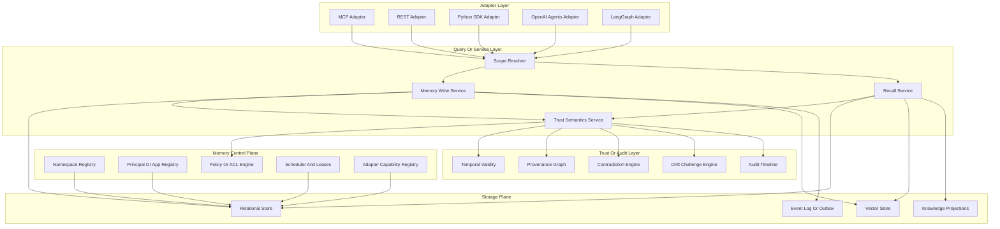
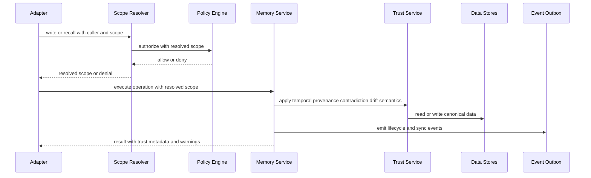

# Universal Memory Architecture

Date: 2026-03-07
Status: Proposed

## Purpose

Define the target architecture for evolving `consolidation-memory` into a universal, model-agnostic shared memory system while preserving current trust guarantees:

- temporal recall
- provenance traceability
- contradiction handling
- drift-aware invalidation
- local-first inspectability

This is a target-system design document, not an implementation patch.

## Scope And Constraints

1. Backward compatibility for current single-project usage remains mandatory during migration.
2. Shared memory is explicit and opt-in. Isolation is the default.
3. "Universal" means shared durable memory across clients and models, not shared hidden prompts, chain-of-thought, or model-internal state.
4. The current trust semantics are treated as platform invariants, not optional features.

## Current Architecture Snapshot

Current repo shape (as of schema version `12` in `database.py`):

- Core engine and service boundary are combined in `MemoryClient`.
- External surfaces (`MCP`, `REST`, Python SDK, OpenAI-style tool schemas, CLI) call the client directly.
- Durable storage is local SQLite + local FAISS + markdown topic projections.
- Trust data exists and is production-meaningful:
  - claim graph (`claims`, `claim_edges`, `claim_sources`, `claim_events`)
  - contradiction log
  - anchors
  - temporal validity fields (`valid_from`, `valid_until`)
  - drift challenge tooling
- Scheduling has a DB-backed lease/scheduler table for automatic consolidation coordination.

Primary current bottleneck:
- the system has strong trust semantics but still behaves as a project-scoped engine with transport wrappers, not a canonical shared-memory platform.

## Target Architecture Overview

## Plane Definitions

### 1. Memory Control Plane

Responsibilities:
- Manage durable multi-tenant identity and sharing boundaries:
  - namespace
  - principal
  - app/client
  - agent
  - session
  - project/repo scope
- Enforce policy defaults and ACL inheritance.
- Coordinate background jobs with leases and scheduler state.
- Track adapter capability metadata and schema versions.

Core control-plane APIs (internal):
- `resolve_scope(input_scope, caller_identity) -> resolved_scope`
- `authorize(action, resolved_scope, resource) -> allow_or_deny`
- `get_scheduler_state(namespace)`
- `acquire_job_lease(job_kind, namespace)`
- `register_adapter_capabilities(adapter_id, capabilities)`

### 2. Storage Plane

Responsibilities:
- Persist canonical memory objects and trust graph.
- Keep retrieval and analytics efficient without weakening auditability.
- Support local-first operation and scalable shared deployments.

Logical storage components:
- Relational store:
  - episodes, knowledge records, claim graph, scope entities, policies
  - eventual universal registry (`memory_objects`)
- Vector store:
  - ANN search for episodes and knowledge records
- Knowledge projections:
  - markdown knowledge files and versions for human inspection
- Event log or outbox:
  - append-only change stream for sync and downstream adapters

Storage invariants:
- no hard delete of trust history by default
- temporal changes are append or supersede events
- provenance edges are append-only

### 3. Adapter Layer

Responsibilities:
- Provide ecosystem-native entry points while preserving canonical semantics.
- Translate external identity/session models into canonical scopes.
- Avoid semantic drift by routing through one service layer.

Adapter contracts:
- Input contract:
  - caller identity
  - operation intent
  - scope envelope
  - payload
- Output contract:
  - canonical IDs
  - trust metadata
  - warnings (uncertainty, contradiction, drift challenges)

Initial adapter targets:
- MCP (existing)
- REST (existing)
- Python SDK (existing)
- OpenAI Agents (new native adapter)
- LangGraph-style integration (new native adapter)

### 4. Query Or Service Layer

Responsibilities:
- Own all semantics shared by every adapter:
  - temporal recall (`as_of`)
  - provenance-aware recall
  - contradiction-aware recall
  - drift-aware claim challenge behavior
  - scope resolution behavior
  - policy evaluation behavior

Required service modules:
- `ScopeResolutionService`
- `MemoryWriteService`
- `RecallService`
- `TrustSemanticsService`
- `PolicyEvaluationService`

Rule:
- adapters do not re-implement trust semantics.

### 5. Sync Or Event Model

Responsibilities:
- Propagate durable memory changes across clients and services.
- Support replay, audit, and eventually external subscriptions.
- Prevent silent divergence in multi-writer deployments.

Event model:
- Outbox event emitted in same transaction as durable write.
- Event types:
  - memory object created or updated
  - claim state transition
  - contradiction detected or resolved
  - drift challenge issued
  - policy change
- Delivery patterns:
  - local polling in local-first mode
  - queue or stream in self-hosted or managed mode

Conflict handling:
- deterministic coexistence or supersede rules
- no silent overwrite of trust-significant facts
- every conflict resolution emits lifecycle events

### 6. Trust Or Audit Layer

Responsibilities:
- Preserve explainability of memory outcomes across all surfaces.
- Provide machine-readable and human-readable evidence chains.

Trust components:
- Temporal validity:
  - point-in-time belief queries
- Provenance graph:
  - source links and derivation edges
- Contradiction engine:
  - contradictory assertions and resolution history
- Drift challenge engine:
  - anchor-to-change impact detection
- Audit timeline:
  - who wrote what, when, under which scope and policy

## Multi-Client Sharing Without Prompt Or Model-State Sharing

Design rule:
- Shared memory is shared as canonical durable objects plus trust metadata, never as hidden prompt state or model internals.

How sharing works:
1. Each write is tagged with canonical scope (`namespace`, `project`, optional `app`, `agent`, `session`, `principal`).
2. Policy engine decides visibility per request.
3. Shared namespace allows multiple clients to see the same durable memory objects.
4. Session transcripts remain session-scoped unless explicitly materialized into durable memory objects.
5. Adapter-local runtime state stays in adapter/session systems, not in universal memory.

Practical effect:
- two clients can share facts, solutions, claims, and provenance in one namespace
- without exposing raw prompts, chain-of-thought, or private runtime context by default

## Deployment Modes

### Local-First

Profile:
- single user, local process, local storage

Runtime:
- SQLite + FAISS + local files
- no mandatory external infra
- minimal policy model with default private namespace

Strength:
- inspectable and easy to debug

### Self-Hosted Shared

Profile:
- team or org deployment on self-managed infrastructure

Runtime:
- shared relational and vector backends
- centralized control-plane services for policy, identity, and leases
- adapter services attach to common control and data planes

Strength:
- intentional cross-client memory sharing with org policy control

### Managed

Profile:
- hosted control plane with optional hybrid data placement

Runtime:
- managed identity, policy, scheduler, audit, and event routing
- optional customer-managed storage plane connectors
- tenant and namespace isolation guarantees

Strength:
- lowest operational burden with stronger multi-tenant controls

## Request And Trust Flow

## Current To Target Mapping

| Current state | Target state | Required refactor |
| --- | --- | --- |
| `MemoryClient` owns transport-facing behavior and semantics | Service layer owns canonical semantics; adapters are thin translators | Extract scope, policy, recall, and trust semantics into internal services |
| Project-level default in config | Request-level resolved scope envelope with namespace/app/agent/session/project | Persist canonical scope entities and implement resolver + defaults |
| Surface wrappers (`server.py`, `rest.py`, `schemas.py`, `cli.py`) call client directly | Adapter framework with explicit contracts | Introduce `adapters/` package and rewire existing surfaces through adapter interfaces |
| Specialized trust tables and per-feature flows | Unified trust layer with canonical lifecycle and provenance APIs | Introduce generalized provenance and lifecycle interfaces while dual-writing legacy tables |
| Local scheduler and background thread coordination | Control-plane scheduler and lease service per namespace | Expand scheduler to namespace-aware job coordination and observable run state |
| Local storage assumptions | Mode-aware storage backends | Add storage abstraction seams for local, self-hosted shared, and managed modes |
| Markdown topics as primary external knowledge artifact | Markdown as projection of canonical objects | Keep markdown projections; make canonical objects and trust graph primary |

## Required Refactors By Workstream

### Workstream A: Scope And Identity
- persist namespace, principal, app, agent, session, project entities
- add resolver defaults for backward compatibility
- enforce explicit opt-in sharing semantics

### Workstream B: Canonical Service Layer
- isolate semantic ownership from transport wrappers
- move temporal/provenance/contradiction/drift behavior into one service path
- require all adapters to use canonical service contracts

### Workstream C: Adapter Framework
- define adapter interface and capability descriptors
- migrate existing MCP/REST/SDK surfaces first
- add native OpenAI Agents and LangGraph integration paths

### Workstream D: Sync And Eventing
- add transactional outbox for durable events
- expose event feed for downstream adapters and automation
- implement deterministic conflict and supersede event policy

### Workstream E: Trust Hardening
- maintain trust invariants under shared-scope reads/writes
- add cross-surface trust parity tests
- add policy audit traces and deny logs

## Risks And Design Guardrails

Key risks:
- semantic drift if adapters bypass canonical services
- accidental cross-namespace leakage from weak default handling
- policy model complexity overwhelming local-first usability
- migration complexity if canonical IDs are introduced too late

Guardrails:
- default isolate, explicit share
- append or supersede over destructive overwrite
- trust metadata required on every adapter response path
- migration phases remain additive until parity tests are green

## Immediate Architectural Next Step

Use this architecture as the contract for:
- `Prompt B3: Add Persistent Shared-Scope Support`

That step should implement the minimal persistent scope entities and resolver-driven defaults required to make intentional shared namespaces real without regressing single-project behavior.
